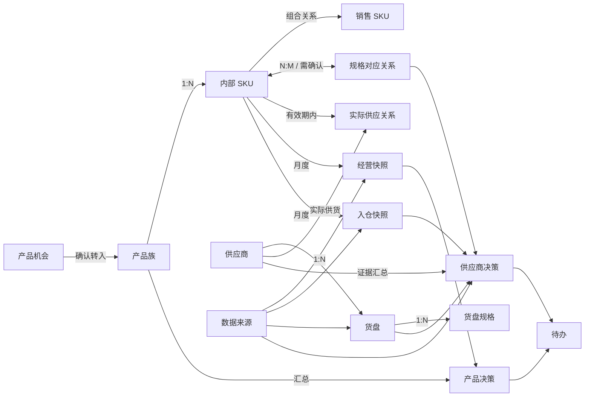

# Aria 工作台领域模型与业务边界

日期：2026-08-25  
版本：v0.1  
状态：作为后续 PRD、开发、测试和复盘的统一基线

## 1. 先给结论

当前工作台与最初计划的主方向一致，但实现已经从“信息沉淀工作台”发展为“产品经营与供应决策工作台”。两者不能再用同一套模糊的“产品/供应商/评分”概念继续扩展。

目前最需要固定的三条边界是：

1. 聚水潭是交易、采购和 ERP 事实来源；工作台不重复做订单、库存、采购执行和财务系统。
2. 产品族是经营判断单位，SKU 是经营证据与供应关联单位。
3. 货盘关联不等于实际供应关系，供应商评分不等于供应商决策。

如果这三条边界不固定，后续会出现“同一数据在多个页面重复录入”“覆盖率被误当成供应商能力”“没有证据却产生评分”等问题。

## 2. 业务目标与非目标

### 2.1 工作台真正要回答的问题

- 哪些入仓产品值得继续经营，哪些需要优化、观察或淘汰？
- 某个产品的供应策略是否合理：谁是当前主供，是否需要备供，是否存在供应风险？
- 供应商下一步应该做什么：保持、调整主备关系、发起质量复核，还是补充事实？
- 每个结论依据什么数据、哪个月份、哪份原始文件或哪次沟通？

### 2.2 明确不做

- 不替代聚水潭做订单、采购单、库存台账、结算和财务利润核算。
- 不做日常运营看板，不要求每天维护。
- 不把没有来源的数据补成 0，不把缺失数据转成“优秀”或“风险低”。
- 不把产品退货率直接归因给供应商；多供应商场景必须先有实际供应关系和质量证据。
- 不把一件代发产品强行纳入入仓产品的库存和供应绩效判断。

## 3. 统一业务术语

| 术语 | 英文/代码建议 | 定义 | 不是它 |
|---|---|---|---|
| 产品机会 | Product Opportunity / `opportunity` | 尚未形成正式经营产品的研究对象，承载机会、竞品、供应商参考和验证过程 | 不是已经在卖的产品 |
| 产品族 | Product Family | 业务上视为同一类产品的集合，例如“无胶白板贴小纸管” | 不是单个 SKU，也不是供应商货盘名称 |
| 入仓产品 | Inbound Product / `existing + inbound` | 已确认进入实际经营和入仓体系的产品族 | 不是产品机会 |
| 观察产品 | Observation Product / `observation` | 一件代发或测试中的产品，只保留观察信息，不纳入入仓库存判断 | 不是正式入仓产品 |
| SKU | Stock Keeping Unit | 可销售、可采购、可统计的最小编码单元；内部编码是公司权威键 | 不是产品族 |
| 销售 SKU | Sales SKU | 聚水潭/店铺销售编码，可能包含组合件后缀，如 `Y-02BBT-8` | 不一定等于基础产品 SKU |
| SKU 组成关系 | SKU Composition | 销售 SKU 与基础组件 SKU 的关系，例如 `Y-02BBT-8` = `Y-02BBT` + 8 支笔 | 不是简单的字符串包含关系 |
| 货盘 | Offer | 某供应商提供的一份货盘或报价资料，保存原始名称、条件和来源 | 不是已选供应商 |
| 货盘规格 | Offer SKU | 货盘中的供应商规格行，可能与内部 SKU 名称不同 | 不是内部 SKU |
| 规格对应关系 | SKU–Offer Link | 内部 SKU 与货盘规格之间的匹配记录，状态可为待确认、已确认、已撤销 | 不是采购决策 |
| 实际供应关系 | Supplier Assignment | 某个 SKU 在某个有效期间实际由哪个供应商主供或备供 | 不是“货盘上出现过” |
| 供应方案 | Supply Strategy | 产品族/SKU 的主供、备供、未启用候选和切换依据 | 不是单纯报价列表 |
| 经营快照 | Operating Snapshot | 某 SKU 某月份的销售、实发、退货、ERP 成本等经营事实 | 不是财务总账 |
| 入仓快照 | Inbound Snapshot | 某 SKU 某月份实际入仓数量及供应商来源 | 不是月末库存台账 |
| 供应商证据 | Supplier Evidence | 实际入仓、报价、质量问题、交付/协同记录等带来源事实 | 不是人工印象分 |
| 产品决策 | Product Decision | 对产品族做出的继续经营、优化、观察、暂停或淘汰结论 | 不是产品机会阶段 |
| 供应商决策 | Supplier Decision | 对供应商关系做出的保持主供、调整主备、质量复核或确认供应商动作 | 不是总分高低 |
| 决策记录 | Decision Record | 保存结论、周期、理由、证据、状态和后续复核时间 | 不是一次性页面提示 |
| 待办 | Task | 由明确行动产生的任务，必须能回到产品、SKU、供应商或货盘对象 | 不是所有缺失字段的集合 |
| 数据来源 | Evidence Source | 聚水潭导出、供应商对账表、货盘报价、聊天记录或人工确认等来源 | 不是“系统自动生成” |

## 4. 核心对象与关系

### 4.1 关系上的硬规则

- 产品族 `1:N` SKU。产品族是纵向经营比较单位，SKU 是展开后的证据明细。
- SKU 与货盘规格是 `N:M`，因为同一 SKU 可有多个供应商，同一货盘也可能包含多个 SKU。
- “已确认规格对应”只说明规格匹配成功，不说明供应商已成为主供。
- “货盘出现过”只说明存在候选来源，不说明发生过实际采购。
- 实际供应关系必须有供应商、SKU、有效期间和来源；不能只用供应商名称推断。
- 产品决策使用产品族汇总和 SKU 明细；供应商决策使用实际供货证据、报价条件和质量/协同证据。
- 退货率是产品质量复核信号。只有在供应商、SKU、期间和质量证据可追溯时，才允许进入供应商复核，不得直接归因。
- 经营快照与入仓快照分开保存；同一月份重新导入只能替换同一口径的快照，不得覆盖其他数据。

## 5. 数据流与页面归属

### 5.1 聚水潭 → 工作台

聚水潭负责采集和产生事实，工作台只接收对决策有用的月度结果：

- 销售/商品表：商品编码、实发数量、退货数量、销售额、实收等可作为经营证据。
- ERP 成本基准：作为产品和供应商成本比较参考，不在工作台做财务利润核算。
- 采购/入仓对账表：商品编码、实际入仓数量、供应商和月份。
- 未来若能导出库存数据，再增加库存快照；当前不以入仓数量代替库存。

### 5.2 供应商/货盘 → 工作台

- 供应商基本资料：供应商主数据。
- 货盘报价：价格、MOQ、交期、规格、原始描述、来源链接。
- 沟通/质量/交付记录：形成供应商证据和协同动作。
- 人工确认：只用于确认匹配、主备关系、无法从来源直接得到的业务判断。

### 5.3 数据最终展示在哪里

| 数据 | 原始入口 | 汇总/决策出口 | 作用 |
|---|---|---|---|
| 实发、退货、ERP 成本 | 聚水潭月度表 | 入仓产品主表、产品详情 | 判断产品经营状态 |
| 实际入仓 | 供应商对账/采购表 | 入仓产品主表、供应商决策总览 | 判断真实供货和供应依赖 |
| 报价、MOQ、交期 | 货盘导入/沟通 | 货盘报价、产品供应方案 | 做供应条件比较 |
| 规格匹配 | SKU 主表 + 手动确认 | 货盘对比、供应方案 | 连接内部 SKU 与外部货盘 |
| 主供/备供 | 供应方案确认 | 产品族、供应商详情 | 决定供应动作 |
| 质量/协同事件 | 供应商详情人工记录 | 供应商决策和待办 | 支撑复核和改善 |
| 产品经营结论 | 产品族经营数据 | 产品主表和决策历史 | 保留可复盘依据 |

## 6. 产品决策与供应商决策的分工

### 产品决策

建议以产品族为主、SKU 为证据，按月复盘：

- 实发数量及环比变化
- 实际入仓数量
- 退货数量/实发数量形成的退货率
- ERP 成本基准
- 供应方案是否稳定
- 必要时再加入库存周转或库存覆盖，但前提是有可靠库存快照

输出：继续经营、需要优化、观察、暂停或淘汰，并保留统计月份、数据来源、理由和复核日期。

### 供应商决策

不以 SKU 覆盖率作为主要评判；覆盖率只做参考。优先回答：

- 是否真实承担了该产品的供货？
- 主供关系是否清晰，是否需要备供？
- 成本、MOQ、交期是否构成供应约束？
- 产品质量信号是否需要发起复核？
- 下一步是保持、调整、复核，还是补证据？

评分只能在有可追溯原始证据时作为参考。没有证据时显示“未采集”，不显示虚假的 A/100。

## 7. 当前实现复盘

### 已基本落地

- 产品机会与入仓产品已经分开表达，且保留机会转入的连续性。
- 内部 SKU 主表、产品族聚合、SKU 展开和月度经营快照已形成基础。
- 货盘保留原始报价，支持列表、卡片、SKU 比价、供应商视图和详情抽屉。
- 货盘规格与内部 SKU 的确认关系已独立保存，支持撤销。
- 月度实际入仓已能进入产品族和供应商决策视图。
- 供应商详情已有决策动作、证据和决策历史，不再只显示无依据的评分。
- 数据同步、类型检查、构建和相关测试已经建立基本保护。

### 仍未完全闭环

1. **产品决策规则还没有成为统一的正式对象。** 页面已有经营字段和提示，但“继续/优化/观察/淘汰”的公式、阈值、版本和历史还需要统一。
2. **实际供应关系与货盘关系仍需进一步分离。** 当前已有 assignment 类型，但页面动作还不能在所有场景直接改变有效期内的主供/备供事实。
3. **供应商评分与供应商决策仍有历史模型重叠。** 评分应降为证据汇总结果，不能继续作为主入口。
4. **销售组合 SKU 的组成关系尚未完全进入聚合链路。** `Y-02BBT-8` 与 `Y-02BBT` 的关系必须通过组成关系或人工确认处理，不能依赖字符串相似度。
5. **数据来源与口径还没有覆盖所有字段。** 每个关键数值应可追溯到月份、文件、工作表和导入批次。
6. **供应商动作与待办尚未完全联动。** 只有真正需要人执行的缺口才生成待办，完成后要回写业务对象。

因此，当前不是推倒重做，而是进入“统一对象和决策规则”的阶段。

## 8. 推荐的下一阶段顺序

1. 固定领域模型、数据字典和来源规则。
2. 统一产品族的产品决策记录和月度判断规则。
3. 统一实际供应关系：主供、备供、有效期、来源和切换历史。
4. 将供应商页面从“评分列表”收敛为“事实 + 证据 + 下一步动作”。
5. 把缺失证据转为可定位的待办，而不是只显示“待补”。
6. 最后再做供应链驾驶舱，只汇总已有指标，不新增一套录入体系。

## 9. 反方观点与处理

反方观点：现在就固定领域模型和文档，可能拖慢页面迭代，而且业务还会变化。

这个风险真实存在。因此不建议编写一次性、上百页的大型系统设计；但当前已经出现供应商 ID 缺失、评分无证据、货盘关联与实际供货混淆、月份默认导致误判等问题，说明对象边界已经影响数据正确性。稳妥做法是维护一份短小、版本化的领域模型，每次功能变更先更新关系和口径，再改页面。

