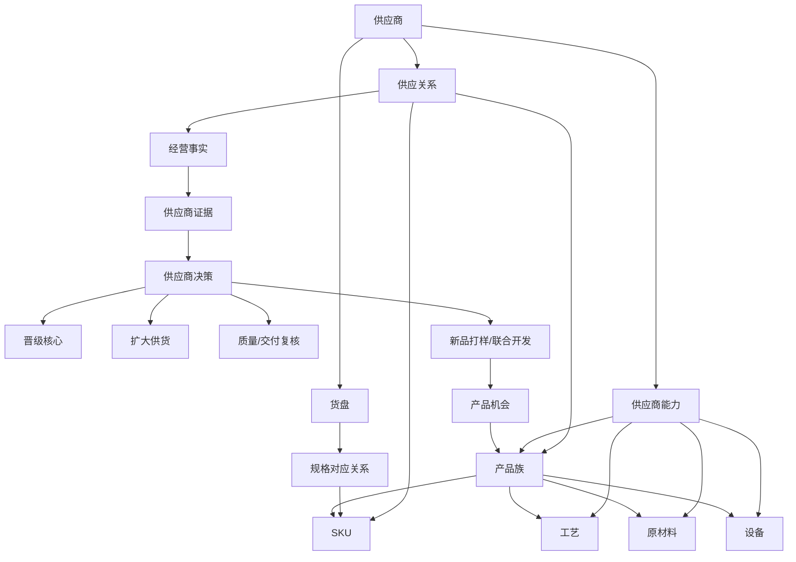

# 供应商能力网络：业务流程与领域模型

日期：2026-08-28  
状态：已确认基线，作为 V1 实施约束

## 1. 目标与边界

供应商板块的目标不是建立一个评分排行榜，而是把供应能力、报价、实际合作表现和产品开发机会连接起来，支持四类判断：当前谁在供、谁供得好、谁能作为备选、谁能参与新品开发。

聚水潭继续作为交易、销售、采购和 ERP 事实来源；工作台只保存对产品和供应链决策有用的月度事实、证据、关系和决策记录。不复制完整订单、库存台账、采购执行或财务结算。

## 2. 统一业务术语

| 术语 | 定义 |
|---|---|
| 产品机会 | 尚未正式经营、但包含产品、工艺或供应链研究信息的对象 |
| 产品族 | 业务上视为同一类产品的集合，不等于单个 SKU |
| SKU | 可销售、可采购、可统计的最小编码单元 |
| 工艺 | 产品制造所需的加工或生产方式 |
| 原材料 | 产品或工艺所需的基础材料 |
| 设备 | 支撑某项工艺或规格生产的设备能力 |
| 供应商 | 可以提供产品、工艺、服务或开发能力的外部合作对象 |
| 供应商能力 | 供应商在产品、工艺、材料、设备、打样和定制方面的能力记录 |
| 候选供应商 | 已发现但尚未验证或合作的供应商 |
| 备用供应商 | 已验证具备供货能力、当前不是主供的供应商 |
| 已合作供应商 | 已有实际供货或明确合作记录的供应商 |
| 核心供应商 | 在稳定性、质量、成本、交付或开发能力方面达到组织标准的供应商 |
| 开发伙伴 | 能参与打样、工艺优化或新品开发的供应商 |
| 货盘 | 供应商提供的一份报价或商品资料 |
| 规格对应关系 | 货盘规格与内部 SKU 的对应记录 |
| 供应关系 | 供应商与产品族或 SKU 之间的主供/备供关系，包含有效期 |
| 经营事实 | 销售、实发、入仓、退货等有来源的数据 |
| 供应商证据 | 报价、质量、交付、沟通、打样等可追溯事实 |
| 供应商决策 | 对供应关系或供应商发展方向做出的判断 |

## 3. 核心对象与关系

约束：货盘不等于供应关系；规格对应不等于主供确认；退货率是质量复核信号，不在多供应商场景下直接归因于某一家；已确认供应关系默认持续有效，只有明确变更才新建关系或结束旧关系。

## 4. 标准业务流程

1. **发现**：从沟通、货盘、调研或实际入仓发现供应商。
2. **建档**：建立供应商主档，记录来源和当前角色。
3. **能力确认**：记录产品族、工艺、原材料、设备、规格、MOQ、交期、打样和定制能力，并保留证据来源。
4. **货盘对应**：保存供应商原始报价，再单独确认货盘规格与内部 SKU 的对应关系。
5. **合作确认**：形成产品族级主供/备供关系，设置生效月份；不因月份切换重复确认。
6. **事实采集**：按月份导入销售、实发、入仓和退货等可获得数据。
7. **证据判断**：将经营事实、报价、交付、质量和沟通记录汇总为可解释证据。
8. **决策动作**：保持合作、调整主备、质量复核、扩大供货、晋级核心或进入开发。
9. **回写复盘**：决策保存周期、理由、来源、状态和待办；完成后回写对象状态。

## 5. V1 不做

- 不复制聚水潭库存、采购单、订单明细或财务结算。
- 没有可靠证据时不自动评分、不自动晋级核心供应商。
- 不自动替换主供。
- 不根据字符串相似度推断工艺、材料或设备能力。
- 不把所有缺失字段都生成待办。

